# Kubernetes Zero Downtime Deployment 🚀

This project demonstrates how to achieve **Zero Downtime Deployment in Kubernetes** using:

- Kubernetes Deployment
- Rolling Updates
- Rollback Strategy
- ClusterIP Service
- NGINX Ingress
- Version-based Application Deployment

The project shows how Kubernetes updates applications without downtime by gradually creating new pods and deleting old pods one by one.

--------------------------------------------------

# Project Architecture

```text
User
  ↓
NGINX Ingress
  ↓
ClusterIP Service
  ↓
Kubernetes Pods (v1 / v2)
```

--------------------------------------------------

# Technologies Used

- Kubernetes
- Docker
- NGINX Ingress Controller
- Linux
- AWS EC2
- Docker Hub

--------------------------------------------------

# Features

✅ Zero Downtime Deployment  
✅ Rolling Update Strategy  
✅ Rollback Support  
✅ Kubernetes Service 
✅ Ingress Controller 
✅ High Availability with Multiple Replicas  

--------------------------------------------------

# Initial Deployment Setup

In this section, the initial version (v1) of the application is deployed inside Kubernetes.

The deployment contains:

- 4 replicas
- ClusterIP service
- NGINX ingress
- v1 Docker image

Kubernetes creates multiple pods to ensure high availability.

--------------------------------------------------

## 1. Deployment YAML for Version 1

This YAML file contains:

- Deployment configuration
- Replica count
- Docker image
- Liveness Probe
- Readiness Probe

### Screenshot

```md
screenshots/initial-deployment-setup/deployment-yml-v1.png
```

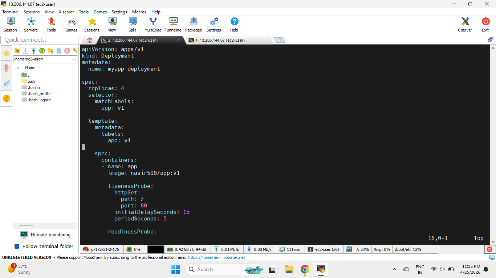

--------------------------------------------------

## 2. Running Pods for Version 1

Here Kubernetes successfully created 4 running pods for version 1.

Important Points:

- All pods are in Running state
- Labels are attached to pods
- Kubernetes maintains desired replica count automatically

### Screenshot

```md
screenshots/initial-deployment-setup/running-pods-v1.png
```

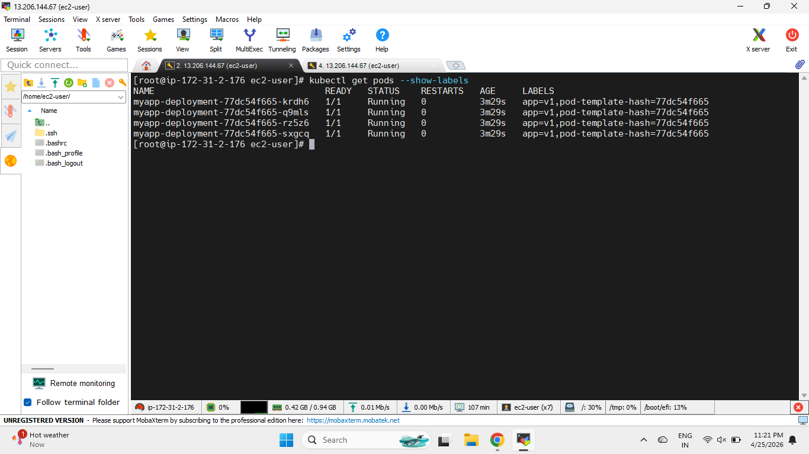

--------------------------------------------------

## 3. ClusterIP Service

The ClusterIP service exposes pods internally inside the Kubernetes cluster.

Important Points:

- Service type is ClusterIP
- Service forwards traffic to pods
- Pods communicate through service abstraction

### Screenshot

```md
screenshots/initial-deployment-setup/clusterip-service.png
```

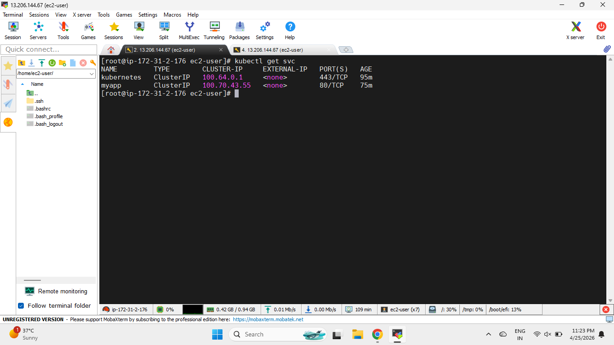

--------------------------------------------------

## 4. NGINX Ingress Configuration

Ingress is used to expose the application externally using a domain name.

Important Points:

- NGINX Ingress Controller is configured
- Domain routing is enabled
- Traffic reaches service through ingress

### Screenshot

```md
screenshots/initial-deployment-setup/nginx-ingress.png
```

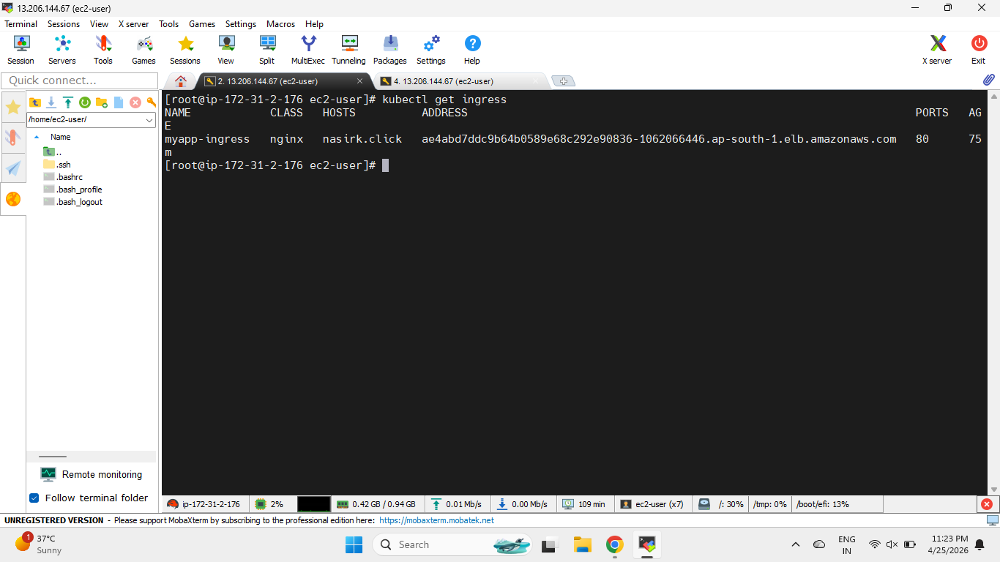

--------------------------------------------------

## 5. Application Successfully Deployed (Version 1)

The application is accessible successfully in the browser.

Current deployed version:

```text
Version 1
```

### Screenshot

```md
screenshots/initial-deployment-setup/application-deployed-v1.png
```

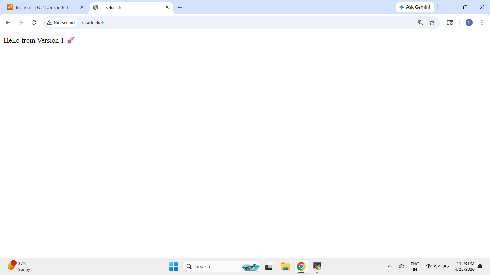

--------------------------------------------------
--------------------------------------------------

# Rolling Update to Version 2

In this section, the Docker image is updated from:

```text
app:v1 → app:v2
```

Kubernetes performs a rolling update without downtime.

Kubernetes gradually creates new pods and deletes old pods one by one without affecting application availability.

--------------------------------------------------

## 1. Updating Deployment YAML to Version 2

The deployment YAML is modified with the new Docker image.

Updated Image:

```yaml
image: nasir590/app:v2
```

### Screenshot

```md
screenshots/rolling-update-to-v2/deployment-yml-v2.png
```

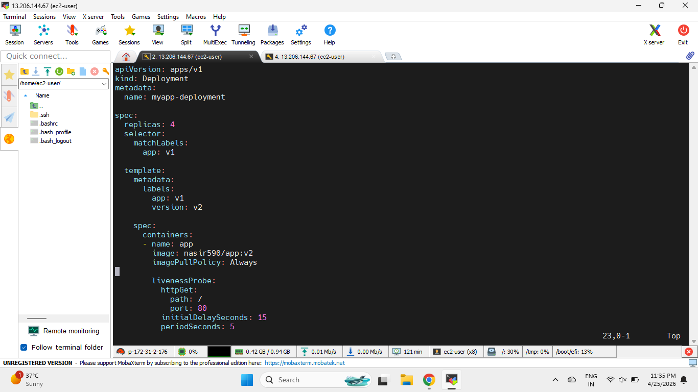

--------------------------------------------------

## 2. Rolling Update Pod Creation Process

Kubernetes gradually creates new pods and deletes old pods one by one.

Important Points:

- New pods are created gradually
- Old pods are deleted gradually
- No downtime occurs during update

### Screenshot

```md
screenshots/rolling-update-to-v2/version2-pods-creation.png
```

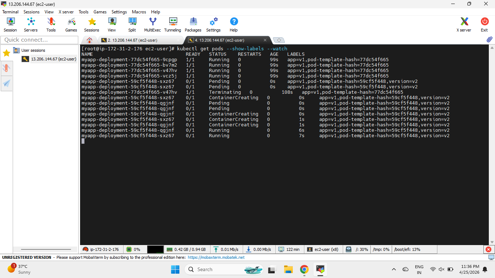

--------------------------------------------------

## 3. New Version 2 Pods Running Successfully

All newly created pods are now running with:

```text
version=v2
```

### Screenshot

```md
screenshots/rolling-update-to-v2/version2-pods.png
```

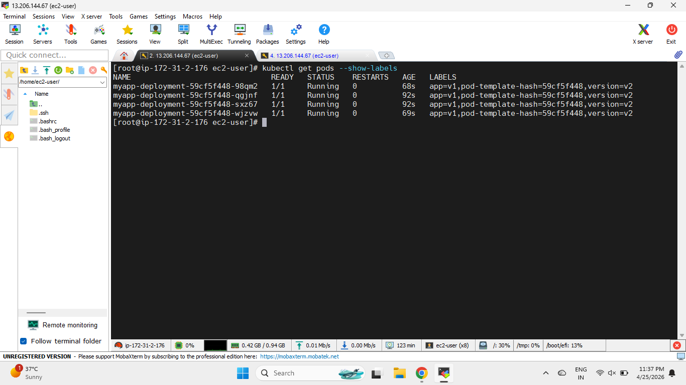

--------------------------------------------------

## 4. Application Shifted to Version 2

The browser now displays:

```text
Hello from Version 2
```

This confirms the rolling update completed successfully.

### Screenshot

```md
screenshots/rolling-update-to-v2/version2-application-deployed.png
```

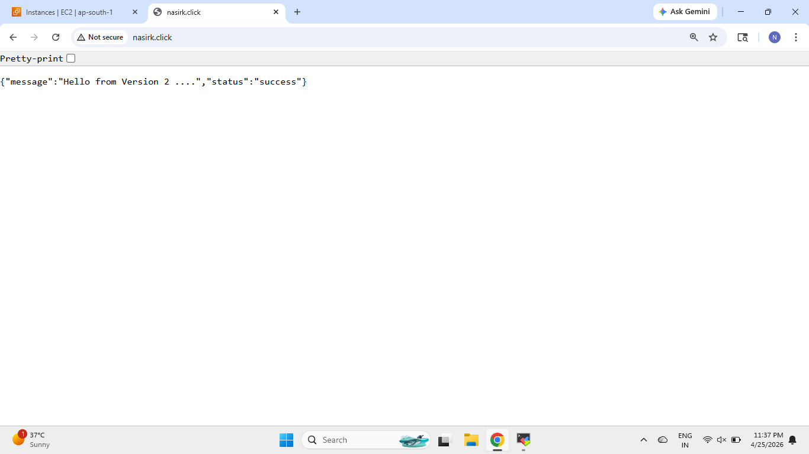

--------------------------------------------------
--------------------------------------------------

# Rollback Process

In this section, the application is rolled back from:

```text
Version 2 → Version 1
```

Rollback helps restore the previous stable version if issues occur in the new deployment.

--------------------------------------------------

## 1. Rollback Command Execution

Kubernetes rollout history is checked and rollback is executed.

Commands Used:

```bash
kubectl rollout history deployment myapp-deployment

kubectl rollout undo deployment myapp-deployment
```

### Screenshot

```md
screenshots/rollback-process/rollback-to-previous-version.png
```

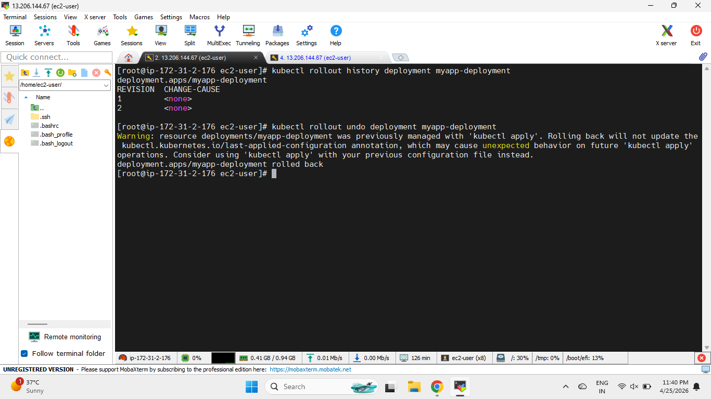

--------------------------------------------------

## 2. Rollback Pod Recreation Process

During rollback:

- Version 2 pods are deleted gradually
- Version 1 pods are recreated gradually
- Traffic continues without downtime

### Screenshot

```md
screenshots/rollback-process/rollback-pods-creation.png
```


--------------------------------------------------

## 3. Previous Version Pods Running Successfully

Now Kubernetes restored the previous stable version pods.

Current Running Version:

```text
Version 1
```

### Screenshot

```md
screenshots/rollback-process/rollback-pods-running.png
```

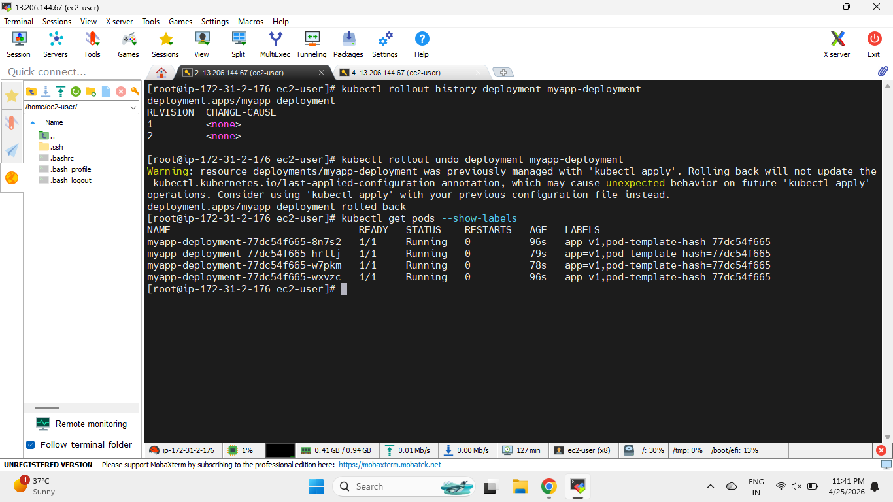

--------------------------------------------------

## 4. Application Successfully Rolled Back to Version 1

The browser now again shows:

```text
Hello from Version 1
```

This confirms rollback completed successfully.

### Screenshot

```md
screenshots/rollback-process/successfully-rollback-to-vservion1.png
```


--------------------------------------------------
--------------------------------------------------

# Final Rollout Verification

This section demonstrates rollout updates using direct Kubernetes rollout commands.

--------------------------------------------------

## 1. Rollout Image Update Command

The deployment image is updated directly using:

```bash
kubectl set image deployment/myapp-deployment app=nasir590/app:v2
```

### Screenshot

```md
screenshots/final-rollout-verification/rollout-done-successfully.png
```


--------------------------------------------------

## 2. Rollout Pod Replacement Process

Kubernetes gradually creates new updated pods and deletes old pods one by one.

Important Points:

- New pods are created gradually
- Old pods are deleted gradually
- Application remains available during rollout

### Screenshot

```md
screenshots/final-rollout-verification/rollout-pods-creation.png
```

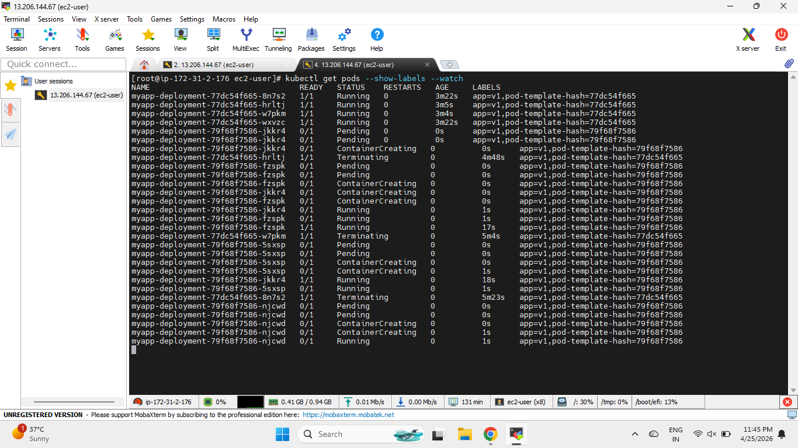

--------------------------------------------------

## 3. Application Successfully Shifted to Version 2

The browser confirms traffic is now served from Version 2.

### Screenshot

```md
screenshots/final-rollout-verification/rollout-to-version2.png
```

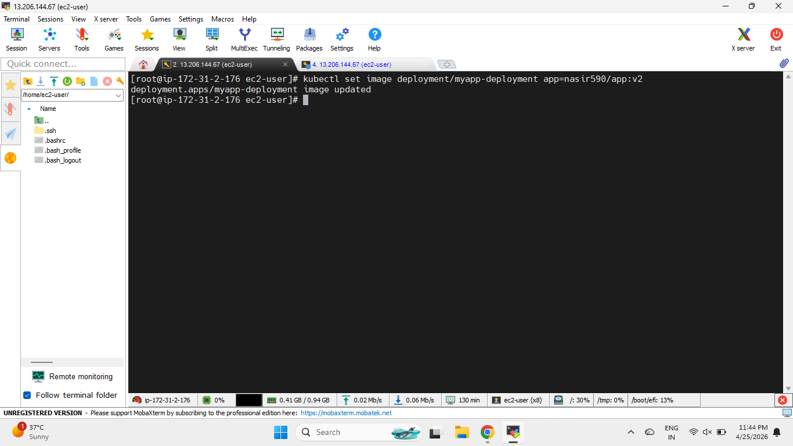

--------------------------------------------------
--------------------------------------------------

# Kubernetes Concepts Covered

- Deployment
- Pods
- ReplicaSets
- ClusterIP Service
- Ingress
- Rolling Updates
- Rollback
- Liveness Probe
- Readiness Probe
- Zero Downtime Deployment

--------------------------------------------------

# Commands Used

## Deployment Commands

```bash
kubectl apply -f deployment.yml
kubectl get pods
kubectl get svc
kubectl get ingress
```

--------------------------------------------------

## Rolling Update Commands

```bash
kubectl set image deployment/myapp-deployment app=nasir590/app:v2
```

--------------------------------------------------

## Rollback Commands

```bash
kubectl rollout history deployment myapp-deployment

kubectl rollout undo deployment myapp-deployment
```

--------------------------------------------------

# Conclusion

This project demonstrates how Kubernetes performs:

- Zero downtime deployments
- Rolling updates
- Rollbacks
- Automatic pod replacement
- High availability deployment strategy

Kubernetes ensures the application remains available even during deployments and updates.

--------------------------------------------------

# Author

## Nasiroddin Khatib

- GitHub: https://github.com/nasiroddin-khatib
- LinkedIn: https://www.linkedin.com/in/nasiroddin-khatib-269841278/

--------------------------------------------------
